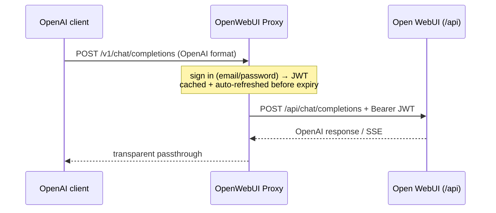

<div align="center">

# 🔌 OpenWebUI Proxy

**A clean OpenAI-compatible API in front of any Open WebUI instance.**

Open WebUI already speaks OpenAI at `/api/chat/completions`, but it lives under `/api` and needs a logged-in **JWT** (when API keys are disabled). This proxy signs in with your Open WebUI account, keeps the JWT fresh, and exposes a standard `/v1` endpoint any client can use — **without opening the Open WebUI interface**.


</div>

---

## ✨ Features

- 🔑 **Auto sign-in** with your Open WebUI email/password → JWT, **refreshed automatically**.
- 🌊 **Streaming + non-streaming** — transparent OpenAI passthrough.
- 🕵️ **Invisible** — only runs inference; never saves chats to your Open WebUI history.
- 📚 **Interactive docs** at **`/docs`** (Swagger, with Authorize).
- 🐳 **Docker-first** — secrets stay in `.env`, never in the image.
- 🔌 **OpenAI drop-in** — works with any OpenAI SDK or client.

## 🚀 Quick start (Docker)

```bash
cp .env.example .env     # set UPSTREAM_BASE + OWUI_EMAIL/OWUI_PASSWORD
docker compose up
```

<details>
<summary>Or the prebuilt image (GHCR)</summary>

```bash
docker run -d --name openwebui-proxy -p 5002:5002 --env-file .env \
  ghcr.io/opastorello/openwebui-proxy:latest
```
</details>

<details>
<summary>Run locally, without Docker</summary>

```bash
pip install -r requirements.txt
uvicorn app:app --port 5002      # reads .env in the working directory
```
</details>

## 🔌 Using it with OpenAI clients

```env
OPENAI_BASE_URL=http://localhost:5002/v1
OPENAI_API_KEY=anything          # or your PROXY_API_KEY, if set
```

**curl:**

```bash
curl http://localhost:5002/v1/chat/completions \
  -H "Content-Type: application/json" \
  -d '{"model":"<model-id>","messages":[{"role":"user","content":"Hello!"}]}'
```

> List the available model ids with `GET http://localhost:5002/v1/models`. You can also set
> `DEFAULT_MODEL` so clients can omit `model`. Open **http://localhost:5002/docs** to try it.

## 🕵️ Does anything show up in Open WebUI?

**No.** The proxy calls only `/api/chat/completions` (inference) with a minimal body — no
`chat_id` / `session_id` / `background_tasks` — and **never** touches the chat-saving endpoints
(`/api/v1/chats/...`). So nothing appears in your chat history or sidebar. *(Server-side admin
usage metrics, if your instance tracks them, are separate and outside the client's control.)*

## 🧠 How it works



## 🔑 Authentication

- **`OWUI_EMAIL` + `OWUI_PASSWORD`** — the proxy signs in and auto-refreshes the JWT (recommended).
- **`OWUI_TOKEN`** — paste a JWT directly (expires ~28 days, no auto-refresh).
- **`PROXY_API_KEY`** (optional) — require clients to send `Authorization: Bearer <key>`; shows up as the **Authorize** button in `/docs`.

## 🧩 Endpoints

| Method | Route | Description |
|--------|-------|-------------|
| `POST` | `/v1/chat/completions` | Chat — streaming + non-streaming (passthrough) |
| `GET`  | `/v1/models` | Models available on the Open WebUI instance |
| `GET`  | `/auth/status` | Signed-in user + JWT expiry |
| `GET`  | `/health` · `/docs` · `/openapi.json` | Health · Swagger UI · OpenAPI |

## ⚙️ Environment variables

See [`.env.example`](.env.example).

| Variable | Default | Description |
|----------|---------|-------------|
| `UPSTREAM_BASE` | `http://localhost:3000` | Your Open WebUI URL |
| `OWUI_EMAIL` / `OWUI_PASSWORD` | _(empty)_ | Login used to sign in and refresh the JWT |
| `OWUI_TOKEN` | _(empty)_ | Static JWT instead of email/password |
| `DEFAULT_MODEL` | _(empty)_ | Model used when the request omits `model` |
| `PROXY_PORT` | `5002` | Host port (container listens on 5002) |
| `PROXY_API_KEY` | _(empty)_ | If set, clients must send `Authorization: Bearer <key>` |
| `BACKEND_TIMEOUT` | `600` | Upstream timeout (s) |

## 🔐 Security

- `.env` holds your Open WebUI login — it's in `.gitignore`; **never** commit it.
- Only expose the proxy publicly with `PROXY_API_KEY` set.

## 🛠️ Troubleshooting

| Symptom | Likely cause / fix |
|---------|--------------------|
| `initial sign-in failed` in logs | Check `UPSTREAM_BASE` and `OWUI_EMAIL`/`OWUI_PASSWORD` |
| `401` from `/v1/...` | `PROXY_API_KEY` is set — send `Authorization: Bearer <key>` |
| Empty `/v1/models` | The signed-in account has no models granted on the instance |
| Upstream errors pass through | The proxy forwards Open WebUI's error body and status as-is |

## 📄 License

[MIT](LICENSE) © [Nicolas Pastorello](https://github.com/opastorello) (**@opastorello**)
